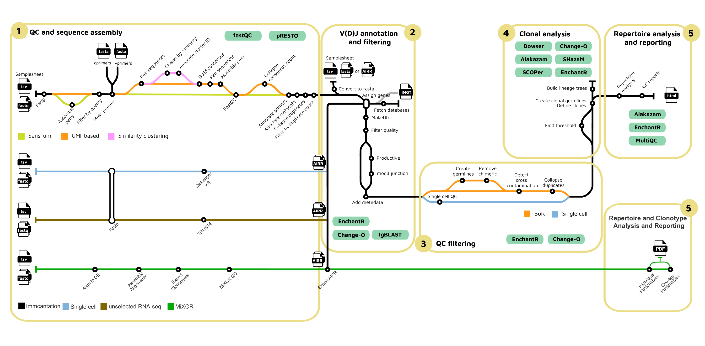

#  

[](https://github.com/nf-core/airrflow/actions?query=workflow%3A%22nf-core+CI%22)
[](https://github.com/nf-core/airrflow/actions?query=workflow%3A%22nf-core+linting%22)
[](https://nf-co.re/airrflow/results)
[](https://doi.org/10.5281/zenodo.2642009)
[](https://www.nextflow.io/)
[](https://docs.conda.io/en/latest/)
[](https://www.docker.com/)
[](https://sylabs.io/docs/)
[](https://nfcore.slack.com/channels/airrflow)
[](https://twitter.com/nf_core)
[](https://www.youtube.com/c/nf-core)

## Introduction

** nf-core/airrflow ** is a bioinformatics best-practice pipeline to analyze B-cell or T-cell repertoire sequencing data. It makes use of the [Immcantation](https://immcantation.readthedocs.io)
toolset. The input data can be targeted amplicon bulk sequencing data of the V, D, J and C regions
of the B/T-cell receptor with multiplex PCR or 5' RACE protocol, or assembled reads (bulk or single cell).


The pipeline is built using [Nextflow](https://www.nextflow.io), a workflow tool to run tasks across multiple compute infrastructures in a very portable manner. It uses Docker/Singularity containers making installation trivial and results highly reproducible. The [Nextflow DSL2](https://www.nextflow.io/docs/latest/dsl2.html) implementation of this pipeline uses one container per process which makes it much easier to maintain and update software dependencies. Where possible, these processes have been submitted to and installed from [nf-core/modules](https://github.com/nf-core/modules) in order to make them available to all nf-core pipelines, and to everyone within the Nextflow community!

On release, automated continuous integration tests run the pipeline on a full-sized dataset on the AWS cloud infrastructure. This ensures that the pipeline runs on AWS, has sensible resource allocation defaults set to run on real-world datasets, and permits the persistent storage of results to benchmark between pipeline releases and other analysis sources. The results obtained from the full-sized test can be viewed on the [nf-core website](https://nf-co.re/airrflow/results).

## Pipeline summary

nf-core/airrflow allows the end-to-end processing of BCR and TCR bulk and single cell targeted sequencing data. Several protocols are supported, please see the [usage documenation](https://nf-co.re/airrflow/usage) for more details on the supported protocols.



1. QC and sequence assembly (bulk only)

- Raw read quality control, adapter trimming and clipping (`Fastp`).
- Filtering sequences by base quality (`pRESTO FilterSeq`).
- Mask amplicon primers (`pRESTO MaskPrimers`).
- Pair read mates (`pRESTO PairSeq`).
- For UMI-based sequencing:
  - Cluster sequences according to similarity (optional for insufficient UMI diversity) (`pRESTO ClusterSets`).
  - Build consensus of sequences with the same UMI barcode (`pRESTO BuildConsensus`).
- Assemble R1 and R2 read mates (`pRESTO AssemblePairs`).
- Remove and annotate read duplicates (`pRESTO CollapseSeq`).
- Filter out sequences that do not have at least 2 duplicates (`pRESTO SplitSeq`).

2. V(D)J annotation and filtering (bulk and single-cell)

- Assign gene segments with `IgBlast` using the IMGT database (`Change-O AssignGenes`).
- Annotate alignments in AIRR format (`Change-O MakeDB`)
- Filter by alignment quality (locus matching v_call chain, min 200 informative positions, max 10% N nucleotides)
- Filter productive sequences (`Change-O ParseDB split`)
- Filter junction length multiple of 3
- Annotate metadata (`EnchantR`)

3. QC filtering (bulk and single-cell)

- Bulk sequencing filtering:
  - Remove chimeric sequences (optional) (`SHazaM`, `EnchantR`)
  - Detect cross-contamination (optional) (`EnchantR`)
  - Collapse duplicates (`Alakazam`, `EnchantR`)
- Single-cell QC filtering (`EnchantR`)
  - Remove cells without heavy chains.
  - Remove cells with multiple heavy chains.
  - Remove sequences in different samples that share the same `cell_id` and nucleotide sequence.
  - Modify `cell_id`s to ensure they are unique in the project.

4. Clonal analysis (bulk and single-cell)

- Find threshold for clone definition (`SHazaM`, `EnchantR`).
- Create germlines and define clones, repertoire analysis (`Change-O`, `EnchantR`).
- Build lineage trees (`SCOPer`, `IgphyML`, `EnchantR`).

5. Repertoire analysis and reporting

- Custom repertoire analysis pipeline report (`Alakazam`).
- Aggregate QC reports (`MultiQC`).

## Quick Start

1. Install [`Nextflow`](https://www.nextflow.io/docs/latest/getstarted.html#installation) (`>=22.10.1`)

2. Install any of [`Docker`](https://docs.docker.com/engine/installation/), [`Singularity`](https://www.sylabs.io/guides/3.0/user-guide/) (you can follow [this tutorial](https://singularity-tutorial.github.io/01-installation/)), [`Podman`](https://podman.io/), [`Shifter`](https://nersc.gitlab.io/development/shifter/how-to-use/) or [`Charliecloud`](https://hpc.github.io/charliecloud/) for full pipeline reproducibility _(you can use [`Conda`](https://conda.io/miniconda.html) both to install Nextflow itself and also to manage software within pipelines. Please only use it within pipelines as a last resort; see [docs](https://nf-co.re/usage/configuration#basic-configuration-profiles))_.

3. Download the pipeline and test it on a minimal dataset with a single command:

   ```console
   nextflow run nf-core/airrflow -profile test,<docker/singularity/podman/shifter/charliecloud/conda/institute> --outdir <OUTDIR>
   ```

   Note that some form of configuration will be needed so that Nextflow knows how to fetch the required software. This is usually done in the form of a config profile (`YOURPROFILE` in the example command above). You can chain multiple config profiles in a comma-separated string.

   > - The pipeline comes with config profiles called `docker`, `singularity`, `podman`, `shifter`, `charliecloud` and `conda` which instruct the pipeline to use the named tool for software management. For example, `-profile test,docker`.
   > - Please check [nf-core/configs](https://github.com/nf-core/configs#documentation) to see if a custom config file to run nf-core pipelines already exists for your Institute. If so, you can simply use `-profile <institute>` in your command. This will enable either `docker` or `singularity` and set the appropriate execution settings for your local compute environment.
   > - If you are using `singularity`, please use the [`nf-core download`](https://nf-co.re/tools/#downloading-pipelines-for-offline-use) command to download images first, before running the pipeline. Setting the [`NXF_SINGULARITY_CACHEDIR` or `singularity.cacheDir`](https://www.nextflow.io/docs/latest/singularity.html?#singularity-docker-hub) Nextflow options enables you to store and re-use the images from a central location for future pipeline runs.
   > - If you are using `conda`, it is highly recommended to use the [`NXF_CONDA_CACHEDIR` or `conda.cacheDir`](https://www.nextflow.io/docs/latest/conda.html) settings to store the environments in a central location for future pipeline runs.

4. Start running your own analysis!

```bash
nextflow run nf-core/airrflow \
-profile <docker/singularity/podman/shifter/charliecloud/conda/institute> \
--input samplesheet.tsv \
--outdir ./results \
--library_generation_method specific_pcr_umi \
--cprimers CPrimers.fasta \
--vprimers VPrimers.fasta \
--umi_length 12 \
--max_memory 8.GB \
--max_cpus 8 \
--outdir ./results
```

See [usage docs](https://nf-co.re/airrflow/usage) for all of the available options when running the pipeline.

## Documentation

The nf-core/airrflow pipeline comes with documentation about the pipeline [usage](https://nf-co.re/airrflow/usage), [parameters](https://nf-co.re/airrflow/parameters) and [output](https://nf-co.re/airrflow/output).

## Credits

nf-core/airrflow was written by [Gisela Gabenet](https://github.com/ggabernet), [Susanna Marquez](https://github.com/ssnn-airr), [Alexander Peltzer](@apeltzer) and [Simon Heumos](@subwaystation).

Further contributors to the pipeline are:

- [@dladd](https://github.com/dladd)

## Contributions and Support

If you would like to contribute to this pipeline, please see the [contributing guidelines](.github/CONTRIBUTING.md).

For further information or help, don't hesitate to get in touch on the [Slack `#airrflow` channel](https://nfcore.slack.com/channels/airrflow) (you can join with [this invite](https://nf-co.re/join/slack)).

## Citations

If you use nf-core/airrflow for your analysis, please cite it using the following DOI: [10.5281/zenodo.2642009](https://doi.org/10.5281/zenodo.2642009)

An extensive list of references for the tools used by the pipeline can be found in the [`CITATIONS.md`](CITATIONS.md) file.

You can cite the `nf-core` publication as follows:

> **The nf-core framework for community-curated bioinformatics pipelines.**
>
> Philip Ewels, Alexander Peltzer, Sven Fillinger, Harshil Patel, Johannes Alneberg, Andreas Wilm, Maxime Ulysse Garcia, Paolo Di Tommaso & Sven Nahnsen.
>
> _Nat Biotechnol._ 2020 Feb 13. doi: [10.1038/s41587-020-0439-x](https://dx.doi.org/10.1038/s41587-020-0439-x).
