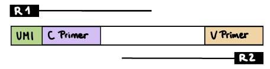
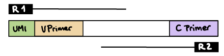
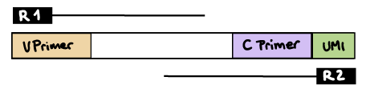
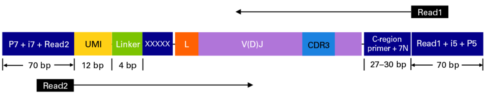
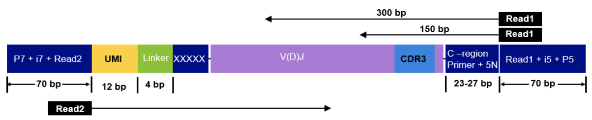

# nf-core/bcellmagic: Usage

## :warning: Please read this documentation on the nf-core website: [https://nf-co.re/bcellmagic/usage](https://nf-co.re/bcellmagic/usage)

> _Documentation of pipeline parameters is generated automatically from the pipeline schema and can no longer be found in markdown files._

## Introduction

The Bcellmagic pipeline allows processing bulk targeted BCR and TCR sequencing data.

## Running the pipeline

The typical command for running the pipeline to analyse BCR repertoires is as follows:

```bash
nextflow run nf-core/bcellmagic -profile docker --input samplesheet.tsv --protocol pcr_umi --cprimers CPrimers.fasta --vprimers VPrimers.fasta --umi_length 12 --loci ig --max_memory 8.GB --max_cpus 8
```

To analyze TCR repertoires, just provide `--loci tr` instead.

For more information about the parameters, please refer to the [parameters documentation](https://nf-co.re/bcellmagic/parameters).
This will launch the pipeline with the `docker` configuration profile. See below for more information about profiles.

Note that the pipeline will create the following files in your working directory:

```bash
work            # Directory containing the nextflow working files
results         # Finished results (configurable, see below)
.nextflow_log   # Log file from Nextflow
# Other nextflow hidden files, eg. history of pipeline runs and old logs.
```

### Input file

The required input file is a sample sheet in TSV format (tab separated) containing the following columns, including the exact same headers:

```bash
ID  Source  Treatment Extraction_time Population  R1  R2  I1
QMKMK072AD  Patient_2 Drug_treatment  baseline  p sample_S8_L001_R1_001.fastq.gz  sample_S8_L001_R2_001.fastq.gz  sample_S8_L001_I1_001.fastq.gz
```

The metadata specified in the input file will then be automatically annotated in a column with the same header in the tables outputed by the pipeline. Where:

* ID: sample ID, should be unique for each sample.
* Source: patient or organism code.
* Treatment: treatment condition applied to the sample.
* Extraction_time: time of cell extraction for the sample.
* Population: B-cell population (e.g. naive, double-negative, memory, plasmablast).
* R1: path to fastq file with first mates of paired-end sequencing.
* R2: path to fastq file with second mates of paired-end sequencing.
* I1: path to fastq with illumina index and UMI (unique molecular identifier) barcode (optional column).

## Supported sequencing protocols

### Protocol: UMI barcoded multiplex PCR

This sequencing type requires setting `--protocol pcr_umi` and providing sequences for the V-region primers as well as the C-region primers. Some examples of UMI and barcode configurations are provided.

#### R1 read contains UMI barcode and C primer

The `--cprimer_position` and `--umi_position` parameters need to be set to R1 (this is the default).
If there are extra bases before the UMI barcode, specify the number of bases with the `--umi_start` parameter (default zero). If there are extra bases between the UMI barcode and C primer, specify the number of bases with the `--cprimer_start` parameter (default zero). Set `--cprimer_position R1` (this is the default).

```bash
nextflow run nf-core/bcellmagic -profile docker \
--input samplesheet.tsv \
--protocol pcr_umi \
--cprimers CPrimers.fasta \
--vprimers VPrimers.fasta \
--umi_length 12 \
--umi_position R1 \
--umi_start 0 \
--cprimer_start 0 \
--cprimer_position R1
```



#### R1 read contains UMI barcode and V primer

The `--umi_position` parameter needs to be set to R1. 
If there are extra bases before the UMI barcode, specify the number of bases with the `--umi_start` parameter (default zero). If there are extra bases between the UMI barcode and V primer, specify the number of bases with the `--vprimer_start` parameter (default zero). Set `--cprimer_position R2`.

```bash
nextflow run nf-core/bcellmagic -profile docker \
--input samplesheet.tsv \
--protocol pcr_umi \
--cprimers CPrimers.fasta \
--vprimers VPrimers.fasta \
--umi_length 12 \
--umi_position R1 \
--umi_start 0 \
--vprimer_start 0 \
--cprimer_position R2
```



#### R2 read contains UMI barcode and C primer

The `--umi_position` and `--cprimer_position` parameters need to be set to R2.
If there are extra bases before the UMI barcode, specify the number of bases with the `--umi_start` parameter (default zero).
If there are extra bases between the UMI barcode and C primer, specify the number of bases with the `--cprimer_start` parameter (default zero).

```bash
nextflow run nf-core/bcellmagic -profile docker \
--input samplesheet.tsv \
--protocol pcr_umi \
--cprimers CPrimers.fasta \
--vprimers VPrimers.fasta \
--umi_length 12 \
--umi_position R2 \
--umi_start 0 \
--cprimer_start 0 \
--cprimer_position R2
```



### Protocol: UMI barcoded 5'RACE PCR

This sequencing type requires setting `--protocol race_5p_umi` and providing sequences for the C-region primers as well as the linker or template switch oligo sequences with the parameter `--race_linker`. Examples are provided below to run Bcellmagic to process amplicons generated with the TAKARA 5'RACE SMARTer Human BCR and TCR protocols (library structure schema shown below).

#### Takara Bio SMARTer Human BCR

```bash
nextflow run nf-core/bcellmagic -profile docker \
--input samplesheet.tsv \
--protocol race_5p_umi \
--cprimers CPrimers.fasta \
--race_linker linker.fasta \
--loci tr \
--umi_length 12 \
--umi_position R2 \
--umi_start 0 \
--cprimer_start 7 \
--cprimer_position R1
```



#### Takara Bio SMARTer Human TCR v2

```bash
nextflow run nf-core/bcellmagic -profile docker \
--input samplesheet.tsv \
--protocol race_5p_umi \
--cprimers CPrimers.fasta \
--race_linker linker.fasta \
--loci tr \
--umi_length 12 \
--umi_position R2 \
--umi_start 0 \
--cprimer_start 5 \
--cprimer_position R1
```

For this protocol, the takara linkers are:

```txt
>takara-linker
GTAC
```

And the C-region primers are:

```txt
>TRAC
CAGGGTCAGGGTTCTGGATATN
>TRBC
GGAACACSTTKTTCAGGTCCTC
>TRDC
GTTTGGTATGAGGCTGACTTCN
>TRGC
CATCTGCATCAAGTTGTTTATC
```



## UMI barcode handling

Unique Molecular Identifiers (UMIs) enable the quantification of BCR or TCR abundance in the original sample by allowing to distinguish PCR duplicates from original sample duplicates.
The UMI indices are random nucleotide sequences of a pre-determined length that are added to the sequencing libraries before any PCR amplification steps, for example as part of the primer sequences.

The UMI barcodes are typically read from an index file but sometimes can be provided at the start of the R1 or R2 reads:

* UMIs in the index file: if the UMI barcodes are provided in an additional index file, set the `--index_file` parameter. Specify the UMI barcode length with the `--umi_length` parameter. You can optionally specify the UMI start position in the index sequence with the `--umi_start` parameter (the default is 0).

* UMIs in R1 or R2 reads: if the UMIs are contained within the R1 or R2 reads, set the `--umi_position` parameter to `R1` or `R2`, respectively. Specify the UMI barcode length with the `--umi_length` parameter.

### Updating the pipeline

When you run the above command, Nextflow automatically pulls the pipeline code from GitHub and stores it as a cached version. When running the pipeline after this, it will always use the cached version if available - even if the pipeline has been updated since. To make sure that you're running the latest version of the pipeline, make sure that you regularly update the cached version of the pipeline:

```bash
nextflow pull nf-core/bcellmagic
```

### Reproducibility

It's a good idea to specify a pipeline version when running the pipeline on your data. This ensures that a specific version of the pipeline code and software are used when you run your pipeline. If you keep using the same tag, you'll be running the same version of the pipeline, even if there have been changes to the code since.

First, go to the [nf-core/bcellmagic releases page](https://github.com/nf-core/bcellmagic/releases) and find the latest version number - numeric only (eg. `1.3.1`). Then specify this when running the pipeline with `-r` (one hyphen) - eg. `-r 1.3.1`.

This version number will be logged in reports when you run the pipeline, so that you'll know what you used when you look back in the future.

## Core Nextflow arguments

> **NB:** These options are part of Nextflow and use a _single_ hyphen (pipeline parameters use a double-hyphen).

### `-profile`

Use this parameter to choose a configuration profile. Profiles can give configuration presets for different compute environments.

Several generic profiles are bundled with the pipeline which instruct the pipeline to use software packaged using different methods (Docker, Singularity, Podman, Shifter, Charliecloud, Conda) - see below.

> We highly recommend the use of Docker or Singularity containers for full pipeline reproducibility, however when this is not possible, Conda is also supported.

The pipeline also dynamically loads configurations from [https://github.com/nf-core/configs](https://github.com/nf-core/configs) when it runs, making multiple config profiles for various institutional clusters available at run time. For more information and to see if your system is available in these configs please see the [nf-core/configs documentation](https://github.com/nf-core/configs#documentation).

Note that multiple profiles can be loaded, for example: `-profile test,docker` - the order of arguments is important!
They are loaded in sequence, so later profiles can overwrite earlier profiles.

If `-profile` is not specified, the pipeline will run locally and expect all software to be installed and available on the `PATH`. This is _not_ recommended.

* `docker`
  * A generic configuration profile to be used with [Docker](https://docker.com/)
  * Pulls software from Docker Hub: [`nfcore/bcellmagic`](https://hub.docker.com/r/nfcore/bcellmagic/)
* `singularity`
  * A generic configuration profile to be used with [Singularity](https://sylabs.io/docs/)
  * Pulls software from Docker Hub: [`nfcore/bcellmagic`](https://hub.docker.com/r/nfcore/bcellmagic/)
* `podman`
  * A generic configuration profile to be used with [Podman](https://podman.io/)
  * Pulls software from Docker Hub: [`nfcore/bcellmagic`](https://hub.docker.com/r/nfcore/bcellmagic/)
* `shifter`
  * A generic configuration profile to be used with [Shifter](https://nersc.gitlab.io/development/shifter/how-to-use/)
  * Pulls software from Docker Hub: [`nfcore/bcellmagic`](https://hub.docker.com/r/nfcore/bcellmagic/)
* `charliecloud`
  * A generic configuration profile to be used with [Charliecloud](https://hpc.github.io/charliecloud/)
  * Pulls software from Docker Hub: [`nfcore/bcellmagic`](https://hub.docker.com/r/nfcore/bcellmagic/)
* `conda`
  * Please only use Conda as a last resort i.e. when it's not possible to run the pipeline with Docker, Singularity, Podman, Shifter or Charliecloud.
  * A generic configuration profile to be used with [Conda](https://conda.io/docs/)
  * Pulls most software from [Bioconda](https://bioconda.github.io/)
* `test`
  * A profile with a complete configuration for automated testing
  * Includes links to test data so needs no other parameters

### `-resume`

Specify this when restarting a pipeline. Nextflow will used cached results from any pipeline steps where the inputs are the same, continuing from where it got to previously.

You can also supply a run name to resume a specific run: `-resume [run-name]`. Use the `nextflow log` command to show previous run names.

### `-c`

Specify the path to a specific config file (this is a core Nextflow command). See the [nf-core website documentation](https://nf-co.re/usage/configuration) for more information.

#### Custom resource requests

Each step in the pipeline has a default set of requirements for number of CPUs, memory and time. For most of the steps in the pipeline, if the job exits with an error code of `143` (exceeded requested resources) it will automatically resubmit with higher requests (2 x original, then 3 x original). If it still fails after three times then the pipeline is stopped.

Whilst these default requirements will hopefully work for most people with most data, you may find that you want to customise the compute resources that the pipeline requests. You can do this by creating a custom config file. For example, to give the workflow process `star` 32GB of memory, you could use the following config:

```nextflow
process {
  withName: star {
    memory = 32.GB
  }
}
```

To find the exact name of a process you wish to modify the compute resources, check the live-status of a nextflow run displayed on your terminal or check the nextflow error for a line like so: `Error executing process > 'bwa'`. In this case the name to specify in the custom config file is `bwa`.

See the main [Nextflow documentation](https://www.nextflow.io/docs/latest/config.html) for more information.

If you are likely to be running `nf-core` pipelines regularly it may be a good idea to request that your custom config file is uploaded to the `nf-core/configs` git repository. Before you do this please can you test that the config file works with your pipeline of choice using the `-c` parameter (see definition above). You can then create a pull request to the `nf-core/configs` repository with the addition of your config file, associated documentation file (see examples in [`nf-core/configs/docs`](https://github.com/nf-core/configs/tree/master/docs)), and amending [`nfcore_custom.config`](https://github.com/nf-core/configs/blob/master/nfcore_custom.config) to include your custom profile.

If you have any questions or issues please send us a message on [Slack](https://nf-co.re/join/slack) on the [`#configs` channel](https://nfcore.slack.com/channels/configs).

### Running in the background

Nextflow handles job submissions and supervises the running jobs. The Nextflow process must run until the pipeline is finished.

The Nextflow `-bg` flag launches Nextflow in the background, detached from your terminal so that the workflow does not stop if you log out of your session. The logs are saved to a file.

Alternatively, you can use `screen` / `tmux` or similar tool to create a detached session which you can log back into at a later time.
Some HPC setups also allow you to run nextflow within a cluster job submitted your job scheduler (from where it submits more jobs).

#### Nextflow memory requirements

In some cases, the Nextflow Java virtual machines can start to request a large amount of memory.
We recommend adding the following line to your environment to limit this (typically in `~/.bashrc` or `~./bash_profile`):

```bash
NXF_OPTS='-Xms1g -Xmx4g'
```
