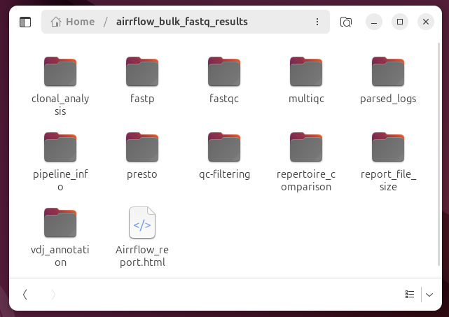

# nf-core/airrflow: Bulk Airr-seq tutorial

This tutorial provides step by step introductions on how to run nf-core/airrflow on bulk AIRR-seq data.

## Pre-requisites

> [!INSTALLATION]
> If you are new to Nextflow and nf-core, please refer to [this page](https://nf-co.re/docs/usage/installation) on how to set up Nextflow and a container engine needed to run this pipeline. At the moment, nf-core/airrflow does NOT support using conda virtual environments for dependency management, only containers are supported. Make sure to [test your setup](https://nf-co.re/docs/usage/introduction#how-to-run-a-pipeline) before running the workflow on actual data.

For the purpose of running this tutorial on your local machine, we recommend a docker installation.

To install docker, follow the instructions [here](https://docs.docker.com/engine/install/). After installation docker on linux, don't forget to check the [post-installation steps](https://docs.docker.com/engine/install/linux-postinstall/).

## Testing the pipeline with built-in tests

Once you have set up your Nextflow and container (docker or singularity), test the airrflow pipeline with built-in test.

```bash
nextflow run nf-core/airrflow -r 4.2.0 -profile test,docker --outdir test_results
```

If the tests run through correctly, you should see this output in your command line:

```bash
output:
```

## Datasets

In this tutorial, we will use nf-core/airrflow to analyze bulk BCR sequencing data from two subjects with multiple sclerosis publicly available on Sequence Read Archive (PRJNA248475) from [Stern et al](https://pubmed.ncbi.nlm.nih.gov/25100741/). The first subject has 3 samples available from a cervical lymph node and 1 sample from a brain lesion while the second subject has 3 samples from the lymph node and 3 samples from a brain lesion. You don't need to download the samples bacause the links to the samples are already provided in the samplesheet.

## Preparing the samplesheet and configuration file

To run the pipeline on bulk BCR/TCR sequencing data, several files must be prepared in advance:

- A tab-separated samplesheet containing the information of each sample. Details on the required columns of a samplesheet are available [here](https://nf-co.re/airrflow/usage#input-samplesheet).
- A configuration file specifying the system's maximum available RAM memory, CPUs and running time. This will ensure that no pipeline process requests more resources than available in the compute infrastructure where the pipeline is running. The resource configuration file is provided with the `-c` option.

> [Tip]
> Before setting memory and cpus in the configuration file, we recommend verifying the available memory and cpus on your system. Otherwise, exceeding the system's capacity may result in an error indicating that you requested more cpus than available or run out of memory.

> [Tip]
> When running nf-core/airrflow with your own data, provide the full path to your input files under the filename column.

A prepared samplesheet for this tutorial can be found [here](bulk_sample_code/metadata_pcr_umi_airr_300.tsv), and the configuration file is available [here](bulk_sample_code/resource.config).
Download both files to the directory where you intend to run the airrflow pipeline.

## Choosing the right protocol profile

Bulk BCR and TCR targeted sequencing can be performed with a wide variety of protocols, using different library preparation methods. Different protocols usually use different amplification primers, UMI barcode lengths and position and will require setting different parameters. To ease running the pipeline on commonly used commercially available kits, we provide parameter presets as profiles. A full [list of protocol profiles](https://nf-co.re/airrflow/docs/usage/#supported-protocol-profiles) is available on the usage documentation page.

You can provide a protocol profile with the `-profile` parameter, followed by other profiles, such as the container engine profile in a comma separated fashion. You will then usually only need to provide as additional parameters the input samplesheet, resource config file and output directory path. However, if you want to override any option or add additional parameters, you can provide them to the airrflow launching command as any parameters in the launch command will override the parameters in the profile.

```bash
nextflow run nf-core/airrflow -r 4.2.0 \
-profile <protocol-profile-name>,docker \
--input samplesheet.tsv \
-c resource.config \
--outdir bulk_fastq_results \
-resume
```

> [Tip]
> We're always looking forward to expanding the set of protocol profiles readily available for other users. Feel free to open an issue and create a pull request to add a new profile that you want to share with other users or ask in the nf-core `#airrflow` [slack channel](https://nf-co.re/join) if you have any questions in doing so.

## Analyzing a dataset with a custom library preparation method

If your dataset was generated using a custom library preparation method, you can manually set the relevant parameters according to your protocol design, similar to the approach we used for the samples in this tutorial. For more examples on how to set the parameters for custom protocols check the [usage documentation](https://nf-co.re/airrflow/docs/usage/#supported-bulk-library-generation-methods-protocols) page.

The BCRseq dataset used in this tutorial was obtained with a multiplexed PCR protocol using custom C-region and V-region primers. We stored the sequences for the V-region primers as well as the C-region primers in AWS S3, and the links are provided in the Nextflow command which will be fetched by nextflow automatically when executing the command. You can also provide the full path to the custom primers fasta files.

The command to launch nf-core/airrflow for the dataset in this tutorial is the following:

```bash
nextflow run nf-core/airrflow -r 4.2.0 \
-profile docker \
--mode fastq \
--input samplesheet.tsv \
--cprimers 's3://ngi-igenomes/test-data/airrflow/pcr_umi/cprimers.fasta' \
--vprimers 's3://ngi-igenomes/test-data/airrflow/pcr_umi/vprimers.fasta' \
--library_generation_method specific_pcr_umi \
--cprimer_position R1 \
--umi_length 15 \
--umi_start 0 \
--umi_position R1 \
-c resource.config \
--outdir bulk_fastq_results \
-resume
```

Of course you can wrap all your code in a bash file. We prepared one for you and it's available [here](bulk_sample_code/airrflow_bulk_b_fastq.sh).
With the bash file, it's easy to run the pipeline with a single-line command.

```bash
bash airrflow_bulk_b_fastq.sh
```

If no UMI barcodes were used, set the --library_generation_method to specific_pcr, and the UMI length will be set automatically to 0.

>[Warning!]
>Please ensure you modify the parameters when running the pipeline on your own data to match the specific details of your library preparation protocol.

> [Tip]
> When launching a Nextflow pipeline with the `-resume` option, any processes that have already been run with the exact same code, settings and inputs will be cached and the pipeline will resume from the last step that changed or failed with an error. The benefit of using "resume" is to avoid duplicating previous work and save time when re-running a pipeline.
> We include "resume" in our Nextflow command as a precaution in case anything goes wrong during execution. After fixing the issue, you can relaunch the pipeline with the same command, it will resume running from the point of failure, significantly reducing runtime and resource usage.

After launching the pipeline the following will be printed to the console output:

```bash
```

Once the pipeline has finished successfully, the following message will appear:

```bash
```

## Important considerations for clonal analysis

An important step in the analysis of AIRR sequencing data is inferring B cell and T cell clones, or clonal groups, sometimes also called clonotypes. These are cells that are derived from the same progenitor cell through clonal expansion. For T cells, this definition is more strict as T cells do not undergo somatic hypermutation, so the TCRs from T cells in the same clone should be identical. For B cells, on the other hand, the BCRs from cells in the same clone can differ due to somatic hypermutation. They also can have a variety of isotypes.

There are two crucial considerations when defining clonal groups with nf-core/airrflow: across which samples should clonal groups be defined, and what should be the clonal threshold, i.e. how different can these receptors be, so that these are assigned to the same clonal group. These are discussed in detail in the following sections.

### Defining clonal groups across samples

Often times we want to analyze clonal groups from the same individual or animal model across time, different conditions or across samples extracted from different tissues. To ensure that the same clone ID (field `clone_id` in the output AIRR rearrangement file) is assigned to the same BCR / TCR clone across these conditions to be able to track the clones, the clonal inference step should be done pulling the sequences from these samples together. This is why, by default, nf-core/airrflow uses the `subject_id` column to group samples prior to defining clonal groups, so it is important to set the exact same subject ID to samples from the same individual across different conditions.

The sample grouping can also be controlled with the [`--cloneby`](https://nf-co.re/airrflow/4.2.0/parameters/#cloneby) parameter, by providing the name of the column containing the group information that should be used to pull the samples together before defining clonal groups (samples or rows with the same string in this column will be grouped together). You can create a new column if you wish for this purpose.

### Clonal inference method

nf-core/airrflow utilizes the Hierarchical clustering method in the [SCOPer](https://scoper.readthedocs.io/) Immcantation tool to infer clonal groups, which initially partitions the BCR / TCR sequences according to V gene, J gene and junction length. Then, it defines clonal groups within each partition by performing hierarchical clustering of the sequences within a partition and cutting the clusters according to an automatically detected or user-defined threshold. More details about this method can be found on the respective SCOPer [vignette](https://scoper.readthedocs.io/en/stable/vignettes/Scoper-Vignette/#). Details on how to determine the clonal threshold can be found in the next section.

### Setting a clonal threshold

The clonal threshold can also be customized through the `--clonal_threshold` parameter. By default, `--clonal_threshold` is set to be 'auto', allowing the threshold of how different two BCRs - or specifically their junction regions - can be to be assigned to the same clonal to be determined automatically using a method included in the [SHazaM](https://shazam.readthedocs.io/) Immcantation tool. You can read more details about the method in the SHazaM [vignette](https://shazam.readthedocs.io/en/stable/vignettes/DistToNearest-Vignette/).

For BCR data, we recommend using this default setting initially. After running the pipeline, you can review the automatically calculated threshold in the `find_threshold` report to make sure it is fitting the data appropriately. If the threshold is unsatisfactory, you can re-run the pipeline with a manually specified threshold (e.g. `--clonal_threshold 0.1`) that is appropriate for your data. For a low number of sequences that are insufficient to satisfactorily determine a threshold with this method, we generally recommend a threshold of 0.1 (length-normalized Hamming distance of nearest neighbors) for human BCR data.

Since TCRs do not undergo somatic hypermutation, TCR clones are defined strictly by identical junction regions. For this reason, the `--clonal_threshold` parameter should be set to 0 for TCR data.

### Including BCR lineage tree computation

BCR lineage tree computation is performed using the [Dowser](https://dowser.readthedocs.io/) Immcantation package. This step is skipped by default because it can be time-consuming depending on the size of the input data and the size of the clonal groups. To enable lineage tree computation, add the `--lineage_trees` parameter set to true. You can easily add lineage tree computation to a previous analysis by re-running the pipeline with the `-resume` so all the previous analysis steps are cached and not recomputed.

Dowser supports different methods for the lineage tree computation, `raxml` is the default but you can set other methods with the `--lineage_tree_builder` parameter, and provide the software executable with the `--lineage_tree_exec` parameter.


## Understanding the results

After running the pipeline, several reports are generated under the result folder.



The analysis steps and their corresponding folders, where the results are stored, are listed below.


1. QC
   - fastp was used to perform quality control, adapter trimming, quality filtering, per-read quality pruning of the FASTQ data. The results are stored under the folder 'fastp'.
   - FastQC was applied to do some quality control checks on raw sequence data. The fastqc report for each fastq file is under the folder named 'fastqc'.

2. Sequence assembly
   - pRESTO is a toolkit for processing raw reads from high-throughput sequencing of B cell and T cell repertoires. It includes features for quality control, primer masking, annotation of reads with sequence embedded barcodes, generation of unique molecular identifier (UMI) consensus sequences, assembly of paired-end reads and identification of duplicate sequences.

3. V(D)J annotation and filtering.
   - In this step, gene segments are assigned using a germline reference. Alignments are annotated in AIRR format. Non-productive sequences and sequences with low alignment quality are removed. Metadata is added. The results are under the folder named 'vdj_annotation'.

4. QC filtering.
   Duplicates are collapsed in this step and the results are available under folder 'qc-filtering'.

5. Clonal analysis.
   - In this step, the Hamming distance threshold of the junction regions is determined when clonal_threshold is set to 'auto' (by default).it should be reviewed for accuracy once the result is out. The threshold result can be found under the folder clonal_analysis/find_threshold.
   - If the automatic threshold is unsatisfactory, you can set the threshold manually and re-run the pipeline.
   (Tip: use -resume whenever running the Nextflow pipeline to avoid duplicating previous work).
   - For TCR data, where somatic hypermutation does not occur, set the clonal_threshold to 0 when running the Airrflow pipeline.
   - Once the threshold is established, clones are assigned to the sequences. A variety of tables and plots associated with clonal analysis were added to the folder 'clonal_analysis/define_clones', such as  sequences_per_locus_table, sequences_per_c_call_table, sequences_per_constant_region_table,num_clones_table, clone_sizes_table,clone size distribution plot, clonal abundance plot, diversity plot and etc.

6. Repertoire analysis.
   - The output folder is'repertoire_comparison'. V gene distribution tables and plots are included in this folder.

7. Other reporting.
   - Additional reports are also generated, including: a multiqc report which summarizes QC metrics across all samples, pipeline_info reports and report_file_size reports.


## Including lineage tree computation

Lineage tree computation is skipped by default because it's time-consuming. To enable lineage tree computation, re-run the pipeline with the --lineage_trees parameter set to true. Remember to include the -resume parameter to avoid duplicating previous work.

## Downstream analysis

Airrflow is a standardized pipeline that is not highly flexible for customized downstream analysis. For such cases, you can use the Airrflow results as input for customized analyses using the Immcantation packages with appropriate parameters. You can find introduction to Bulk B cell repertoire analysis using the Immcantation framework [here](https://immcantation.readthedocs.io/en/stable/getting_started/intro-lab.html).
