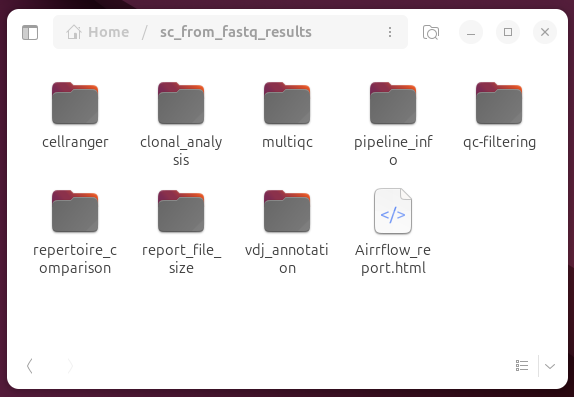

# nf-core/airrflow: Single-cell tutorial

This tutorial provides a step by step introduction on how to run nf-core/airrflow on single-cell BCR-seq data or single-cell TCR-seq data.

## Pre-requisites

> [!INSTALLATION]
> If you are new to Nextflow and nf-core, please refer to [this page](https://nf-co.re/docs/usage/installation) on how to set up Nextflow and a container engine needed to run this pipeline. At the moment, nf-core/airrflow does NOT support using conda virtual environments for dependency management, only containers are supported. Make sure to [test your setup](https://nf-co.re/docs/usage/introduction#how-to-run-a-pipeline) before running the workflow on actual data.

For the purpose of running this tutorial on your local machine, we recommend a docker installation.

To install docker, follow the instructions [here](https://docs.docker.com/engine/install/). After docker installation on linux system, don't forget to check the [post-installation steps](https://docs.docker.com/engine/install/linux-postinstall/).

## Testing the pipeline with built-in tests

Once you have set up your Nextflow and container (docker or singularity), test the airrflow pipeline with built-in test.

```bash
nextflow run nf-core/airrflow -r 4.2.0 -profile test,docker --outdir test_results
```

If the tests run through correctly, you should see this output in your command line:

```bash
output:
```

## Supported input formats

There are two supported input formats for nf-core/airrflow single-cell AIRRseq pipeline: assembled sequences in AIRR rearrangement format or departing from raw reads in fastq format sequenced in the 10x Genomics platform.

The [AIRR rearrangement format](https://docs.airr-community.org/en/latest/datarep/rearrangements.html) is a standard format to store BCR and TCR sequence data with relevant metadata fields. This format is supported as input and output by multiple tools specific for analyzing AIRR sequencing data. For example, when analyzing single-cell AIRR sequencing data with CellRanger versions >= 4.0 an AIRR rearrangement file will be provided as output, and this is the recommended input for running nf-core/airrflow. Note that it is also possible to start running the pipeline directly from raw sequencing reads, and in this case CellRanger will be run when launching nf-core/airrflow.

The AIRR rearrangement format is also the default one when analyzing publicly available data from specialized AIRRseq databases such as the AIRR Data Commons through the [iReceptor gateway](https://gateway.ireceptor.org/login).

In this tutorial we will showcase how to run nf-core/airrflow with both of the input formats.


## Starting from AIRR rearrangement format

### Datasets

For this tutorial we will use subsampled PBMC single-cell BCR sequencing data from two subjects, before (d0) and after flu vaccination (d12).
The dataset is publicly available on [Zenodo](https://zenodo.org/doi/10.5281/zenodo.11373740).
You don't need to download the dataset bacause the links to the samples are already provided in the samplesheet and Nextflow will get the data from the links automatically when running the pipeline.

### Preparing the samplesheet and configuration file

To run the pipeline, a tab-separated samplesheet that provides the path to the AIRR rearrangement files must be prepared.
The samplesheet collects experimental details that are important for the data analysis.
Details on the required columns of a samplesheet are available [here](https://nf-co.re/airrflow/usage#assembled-input-samplesheet-bulk-or-single-cell-sequencing).

A prepared samplesheet for this tutorial can be found [here](sample_data_code/assembled_samplesheet.tsv), and the configuration file is available [here](sample_data_code/resource.config).
Download both files to the directory where you intend to run the airrflow pipeline.

The resource configuration file sets the compute infrastructure maximum available number of CPUs, RAM memory and running time. This will ensure that no pipeline process requests more resources than available in the compute infrastructure where the pipeline is running. The resource config should be provided with the `-c` option.

> [Tip]
> Before setting memory and cpus in the configuration file, we recommend verifying the available memory and cpus on your system. Otherwise, exceeding the system's capacity may result in an error indicating that you requested more cpus than available or run out of memory.

> [Tip]
> When running nf-core/airrflow with your own data, provide the full path to your input files under the filename column.

### Running airrflow

With all the files ready, you can proceed to start the pipeline run:

```bash
nextflow run nf-core/airrflow -r 4.2.0 \
-profile docker \
--mode assembled \
--input assembled_samplesheet.tsv \
--outdir sc_from_assembled_results  \
-c resource.config \
-resume
```

Of course you can wrap all your code in a bash file. We prepared one for you and it's available [here](sample_data_code/airrflow_sc_from_assembled.sh).
With the bash file, it's easy to run the pipeline with a single-line command.

```bash
bash airrflow_sc_from_assembled.sh
```

> [Tip]
> When launching a Nextflow pipeline with the `-resume` option, any processes that have already been run with the exact same code, settings and inputs will be cached and the pipeline will resume from the last step that changed or failed with an error. The benefit of using "resume" is to avoid duplicating previous work and save time when re-running a pipeline.
> We include "resume" in our Nextflow command as a precaution in case anything goes wrong during execution. After fixing the issue, you can relaunch the pipeline with the same command, it will resume running from the point of failure, significantly reducing runtime and resource usage.

After launching the pipeline the following will be printed to the console output:

```bash
```

Once the pipeline has finished successfully, the following message will appear:

```bash
```

## Starting from raw reads in fastq format

### Datasets

For this tutorial we will use subsampled blood single-cell TCR sequencing data of one subject generated from the 10x Genomic platform. The links to the fastq files are in the samplesheet.

### Preparing samplesheet, gene reference and configuration file

To run the airrflow pipeline on single cell TCR or BCR sequencing data from fastq files, we need to prepare samplesheet, pre-built 10x genomics V(D)J references and configuration file in advance. Details on the required columns for this samplesheet are available [here](https://nf-co.re/airrflow/usage#fastq-input-samplesheet-single-cell-sequencing).

The prepared samplesheet for this tutorial is [here](sample_data_code/10x_sc_raw.tsv) and a prepared configuration file is [here](sample_data_code/resource.config). Download these two files to the directory where you intend to run the airrflow pipeline.

> [Tip]
> Before setting memory and cpus in the configuration file, we recommend verifying the available memory and cpus on your system. Otherwise, exceeding the system's capacity may result in an error indicating that you requested more cpus than available or run out of memory.

Pre-built 10x genomics V(D)J references can be accessed at the [10x Genomics website](https://www.10xgenomics.com/support/software/cell-ranger/downloads). Both human and mouse V(D)J references are available. Download the reference that corresponds to the species of your dataset.

### Running airrflow
With all the files ready, it's time to run the airrflow pipeline.

```bash
nextflow run nf-core/airrflow -r 4.2.0 \
-profile docker \
--mode fastq \
--input 10x_sc_raw.tsv \
--library_generation_method sc_10x_genomics \
--reference_10x refdata-cellranger-vdj-GRCh38-alts-ensembl-7.1.0 \
-c resource.config \
--clonal_threshold 0 \
--outdir sc_from_fastq_results \
-resume
```

In this tutorial, since the samples are TCRs, which do not have somatic hypermutation, clones are defined strictly by identical junction regions. For this reason, we set the `--clonal_threshold` parameter to 0. For more details on important considerations when performing clonal analysis check the section below.

Of course you can wrap all your code in a bash file. We prepared one for you and it's available [here](sample_data_code/airrflow_sc_from_fastq.sh).
With the bash file, it's easy to run the pipeline with a single-line command.

```bash
bash airrflow_sc_from_fastq.sh
```

## Important considerations for clonal analysis

An important step in the analysis of AIRR sequencing data is inferring B cell and T cell clones, or clonal groups, sometimes also called clonotypes. These are cells that are derived from the same progenitor cell through clonal expansion. For T cells, this definition is more strict as T cells do not undergo somatic hypermutation, so the TCRs from T cells in the same clone should be identical. For B cells, on the other hand, the BCRs from cells in the same clone can differ due to somatic hypermutation. They also can have a variety of isotypes.

There are two crucial considerations when defining clonal groups with nf-core/airrflow: across which samples should clonal groups be defined, and what should be the clonal threshold, i.e. how different can these receptors be, so that these are assigned to the same clonal group. These are discussed in detail in the following sections.

### Defining clonal groups across samples

Often times we want to analyze clonal groups from the same individual or animal model across time, different conditions or across samples extracted from different tissues. To ensure that the same clone ID (field `clone_id` in the output AIRR rearrangement file) is assigned to the same BCR / TCR clone across these conditions to be able to track the clones, the clonal inference step should be done pulling the sequences from these samples together. This is why, by default, nf-core/airrflow uses the `subject_id` column to group samples prior to defining clonal groups, so it is important to set the exact same subject ID to samples from the same individual across different conditions.

The sample grouping can also be controlled with the [`--cloneby`](https://nf-co.re/airrflow/4.2.0/parameters/#cloneby) parameter, by providing the name of the column containing the group information that should be used to pull the samples together before defining clonal groups (samples or rows with the same string in this column will be grouped together). You can create a new column if you wish for this purpose.

### Clonal inference method

nf-core/airrflow utilizes the Hierarchical clustering method in the [SCOPer](https://scoper.readthedocs.io/) Immcantation tool to infer clonal groups, which initially partitions the BCR / TCR sequences according to V gene, J gene and junction length. Then, it defines clonal groups within each partition by performing hierarchical clustering of the sequences within a partition and cutting the clusters according to an automatically detected or user-defined threshold. More details about this method can be found on the respective SCOPer [vignette](https://scoper.readthedocs.io/en/stable/vignettes/Scoper-Vignette/#). Details on how to determine the clonal threshold can be found in the next section.

### Setting a clonal threshold

The clonal threshold can also be customized through the `--clonal_threshold` parameter. By default, `--clonal_threshold` is set to be 'auto', allowing the threshold of how different two BCRs - or specifically their junction regions - can be to be assigned to the same clonal to be determined automatically using a method included in the [SHazaM](https://shazam.readthedocs.io/) Immcantation tool. You can read more details about the method in the SHazaM [vignette](https://shazam.readthedocs.io/en/stable/vignettes/DistToNearest-Vignette/).

For BCR data, we recommend using this default setting initially. After running the pipeline, you can review the automatically calculated threshold in the `find_threshold` report to make sure it is fitting the data appropriately. If the threshold is unsatisfactory, you can re-run the pipeline with a manually specified threshold (e.g. `--clonal_threshold 0.1`) that is appropriate for your data. For a low number of sequences that are insufficient to satisfactorily determine a threshold with this method, we generally recommend a threshold of 0.1 (length-normalized Hamming distance of nearest neighbors) for human BCR data.

Since TCRs do not undergo somatic hypermutation, TCR clones are defined strictly by identical junction regions. For this reason, the `--clonal_threshold` parameter should be set to 0 for TCR data.

### Including BCR lineage tree computation

BCR lineage tree computation is performed using the [Dowser](https://dowser.readthedocs.io/) Immcantation package. This step is skipped by default because it can be time-consuming depending on the size of the input data and the size of the clonal groups. To enable lineage tree computation, add the `--lineage_trees` parameter set to true. You can easily add lineage tree computation to a previous analysis by re-running the pipeline with the `-resume` so all the previous analysis steps are cached and not recomputed.

Dowser supports different methods for the lineage tree computation, `raxml` is the default but you can set other methods with the `--lineage_tree_builder` parameter, and provide the software executable with the `--lineage_tree_exec` parameter.

## Understanding the results

After running the pipeline, several reports are generated under the result folder.




The summary report, named `Airrflow_report.html`, provides an overview of the analysis results, such as an overview of the number of sequences per sample in each of the pipeline steps, the V(D)J gene assignment and QC, and V gene family usage. Additionally, it contains links to detailed reports for other specific analysis steps.

The analysis steps and their corresponding folders, where the results are stored, are briefly listed below. Detailed documentation on the pipeline output can be found on the [Output documentation page](https://nf-co.re/airrflow/docs/output/).

1. QC and sequence assembly (if starting from fastq files).
   - In this first step, Cell Ranger's VDJ algorithm is employed to assemble contigs, annotate contigs, call cells and generate clonoytpes. The results are stored in the 'cellranger' folder.

2. V(D)J annotation and filtering.
   - In this step, gene segments are assigned using a germline reference. Alignments are annotated in AIRR format. Non-productive sequences and sequences with low alignment quality are removed. Metadata is added. The results are under the folder named 'vdj_annotation'.

3. QC filtering.
   - In this step, cells without heavy chains or with multiple heavy chains are removed. Sequences in different samples that share the same cell_id and necleotide sequence are filtered out. The result are stored in the 'qc-filtering' folder.

4. Clonal analysis.
   - In this step, the Hamming distance threshold of the junction regions is determined when clonal_threshold is set to 'auto' (by default). It should be reviewed for accuracy once the result is out. The threshold result can be found under the folder clonal_analysis/find_threshold.
   - If the automatic threshold is unsatisfactory, you can set the threshold manually and re-run the pipeline.
   (Tip: use -resume whenever running the Nextflow pipeline to avoid duplicating previous work).
   - For TCR data, where somatic hypermutation does not occur, set the clonal_threshold to 0 when running the Airrflow pipeline.
   - Once the threshold is established, clones are assigned to the sequences. A variety of tables and plots associated with clonal analysis were added to the folder `clonal_analysis/define_clones`, such as  sequences_per_locus_table, sequences_per_c_call_table, sequences_per_constant_region_table, num_clones_table, clone_sizes_table,clone size distribution plot, clonal abundance plot, diversity plot and etc.

5. Repertoire analysis.
   - Calculation of several repertoire characteristics, e.g. V gene usage, for comparison between subjects, time points or cell populations. The output folder is `repertoire_comparison`.

6. Other reporting.
   Additional reports are also generated, including:
   - MultiQC report: summarizes QC metrics across all samples.
   - Pipeline_info report: various reports relevant to the running and execution of the pipeline.
   - Report_file_size report: Summary of the number of sequences left after each of the most important pipeline steps.

## Understanding error messages


## Costumizing your analysis and generating your own figures

nf-core/airrflow is a standardized pipeline that performs the different computational analysis steps and provides standard figures for a first data exploration. The computations results (e.g. clonal inference, mutation frequency analysis) are stored in the output AIRR rearrangement repertoire files in newly generated columns under `clonal_analysis/define_clones/all_repertoires`. You can use these Airrflow results as input for customized analyses using R and the Immcantation tools. You can find the tutorial for Immcantation's single-cell V(D)J analysis [here](https://immcantation.readthedocs.io/en/stable/getting_started/10x_tutorial.html).


